# GLM Application

## Installation and Usage of the Application
1. Install Android Studios
2. Clone this project on your local repository
3. Go to the folder `GLM` then copy the path above in your file explorer
4. In Android Studios, go to `File` then `Open`
5. Paste the path 
6. To make sure the gradle files are synced up, go to `File` then `Sync Project with Gradle Files` 
7. To run the the GLM application on Android Studios, it is recommended that you have an Intel processor.
   - Locate the run icon, located on the top of Android Studios that is shaped like a play button. Alternatively you can do `Shift` + `F10` as the default keybind.
   - A prompt will pop up display to you to install Android Emulator Hypervisor Driver
   - Go ahead and install it
   - A system restart might be required if noted by Android Studios, otherwise you are able to run the GLM application with the onboard emulator
8. If you have an AMD processor, it is still possible to run the application on the Android Studios emulator, but with a few workarounds that may not be ideal.
   - Visit the [guide for AMD processor](https://github.com/google/android-emulator-hypervisor-driver-for-amd-processors) and do as the instructions say
   - Locate the run icon, located on the top of Android Studios that is shaped like a play button. Alternatively you can do `Shift` + `F10` as the default keybind.
   - A prompt will pop up display to you to install Android Emulator Hypervisor Driver
   - Go ahead and install it

# User Manual

## Table of Contents
* [Getting Started](#getting-started)
* [Adding a New List](#adding-a-new-list)
* [Selecting a List](#selecting-a-list)
* [Renaming a List](#renaming-a-list)
* [Deleting a List](#Deleting-a-list)
* [Adding Items to a List](#adding-items-to-a-list)
* [Renaming an Item in a List](#renaming-an-item-in-a-list)
* [Changing the Category of an Item](#changiing-the-catgeory-of-an-item)
* [Changing the Amount of an Item](#changing-the-amount-of-an-item)
* [Deleting an Item in a List](#deleting-an-item-in-a-list)
* [Checking Item off a List](#checking-item-off-a-list)
* [Searching](#searching)
* [Data Persistence](#data-persistence)

## Getting Started
After the user loads up the GLM application, the user will be taken to the first page of the application, which is the list of lists. If this is the first time the user has booted up the application, it will have no lists.

## Adding a New List
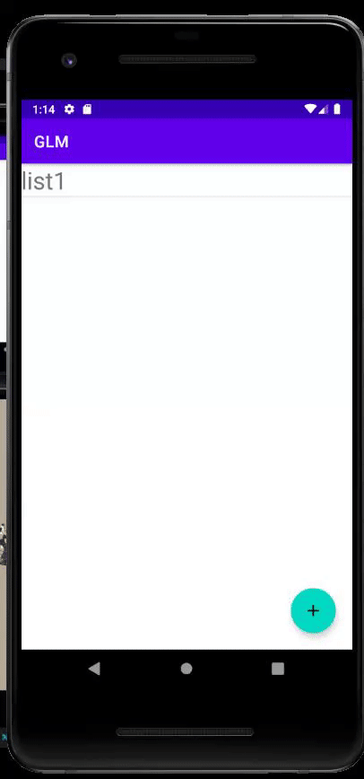
- To add a new list, click on the circular `+` icon on the bottom right of the application. 
- A popup will appear asking you to enter a name. 
- Here you will enter the name of your new list. 
- Press `OK` to create your new list.

## Selecting a List
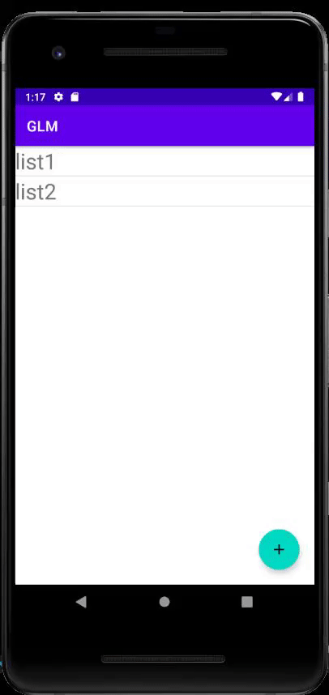
- To select a list, simply tap on the desired list. You will know you are in a list once the title changes from `GLM` to the name of your list.

## Renaming a List
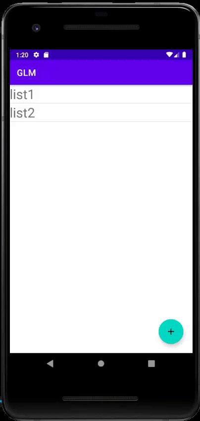
- To rename a list, simply long hold the list you want to rename.
- A popup menu with `Rename` and `Delete` will appear.
- Press `Rename`.
- Here you will enter the new name of your list.
- Press `OK` to rename your list.

## Deleting a List
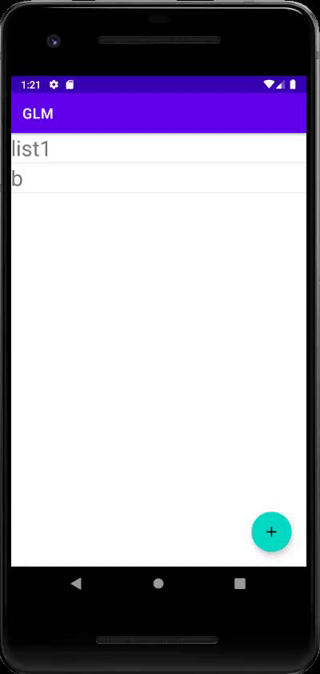
- To delete a list, simply long hold the list you want to delete.
- A popup menu with `Rename` and `Delete` will appear.
- Press `Delete` to delete your list.

## Adding Items to a List
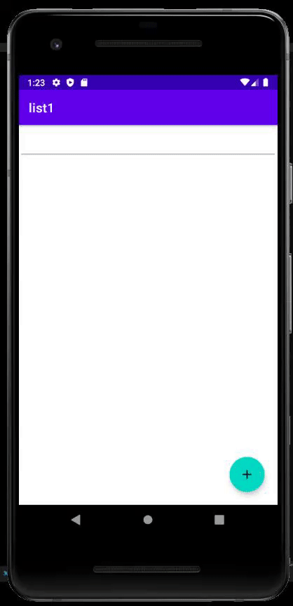
- To add an item to a list, you must be within a list (Refer back to selecting a list).
- Once in the list, press the circular `+` on the bottom right.
- A popup menu will appear asking you to enter a name.
- Enter the name of the item you would like to add to your list.
- The item will appear in your list with default value of `None` and `1` for category and quantity.

## Renaming an Item in a List
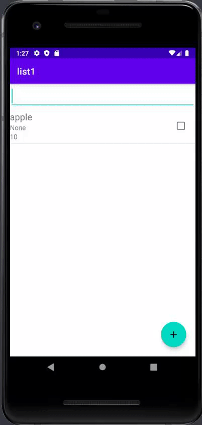
- To rename an item in your list, long hold the item you wish to rename.
- A popup menu with `Edit` and `Delete` will appear.
- Press `Edit`.
- Another popup menu will appear with `Rename`, `Change Category`, and `Change Amount`.
- Press `Rename`.
- A popup will appear asking you to enter a name. 
- Here you will enter the new item of your item.
- Press `OK` to rename your item.

## Changing the Category of an Item
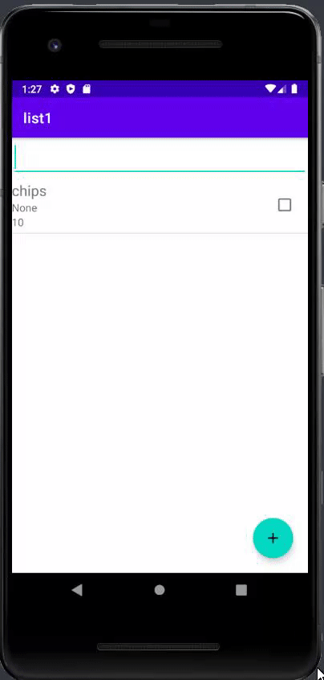
- To change the category of an item, long hold the item you wish to change the category of.
- A popup menu with `Edit` and `Delete` will appear.
- Press `Edit`.
- Another popup menu will appear with `Rename`, `Change Category`, and `Change Amount`.
- Press `Change Category`.
- A popup menu will appear with a list of pre-defined categories (Note: Scroll down to view more).
- Select the category you want.

## Changing the Amount of an Item
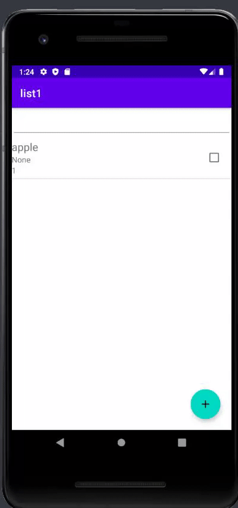
- To change the amoung of an item, long hold the item you wish to change the amount of.
- A popup menu with `Edit` and `Delete` will appear.
- Press `Edit`.
- Another popup menu will appear with `Rename`, `Change Category`, and `Change Amount`.
- Press `Change Amount`.
- A popup will appear asking you to enter an amount.
- Here you will enter the correct amount of items you would like.
- Press `OK` to change the amount.

## Deleting an Item in a List
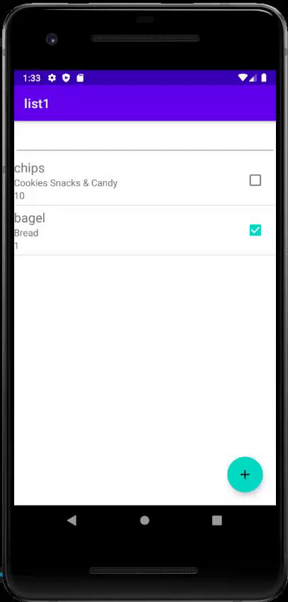
- To delete an item from a list, long hold the item you wish to delete.
- A popup menu with `Edit` and `Delete` will appear.
- Press `Delete` to delete the item from your lise.

## Checking Item off a List
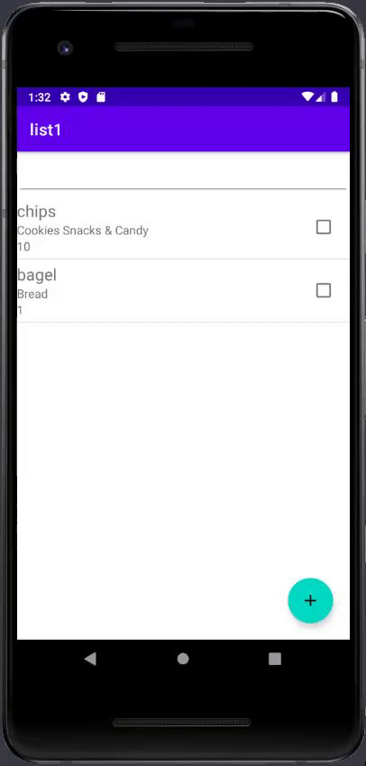
- To check off an item from a list, simply press the box on the far right of the item you would like to check off.
- The icon should have a green checkmark once pressed to indicate that the item has been checked.

## Searching
- There is two ways to search for an item in a list:
- 1) We can search by the category that the item belongs to
- 2) We can search by the item itself 
### Searching By Category
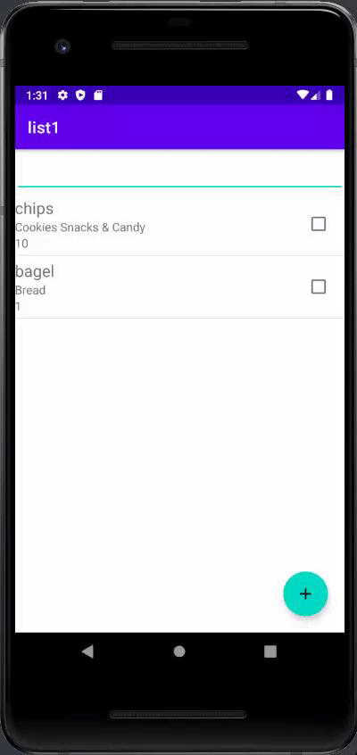
- To search by category, press the search bar on top of the list to start searching.
- Enter a category that you have in your list.
- In the example GIF, `Cookies Snacks & Candy` was used to retrieve `chips`, which belonged to that said category.

### Searching By Item
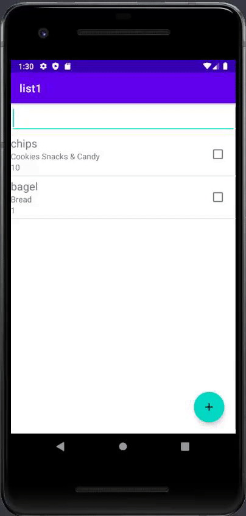
- To search by item, press the search bar on top of the list to start searching.
- Enter an item that you have in you list.
- In the example GIF, entering `bagel` would return `bagel` if it exists in the list.

## Data Persistence
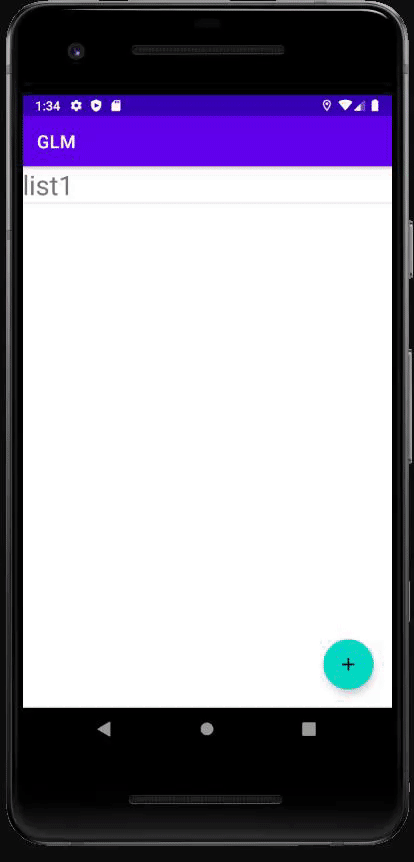
- This is to show that the data is persisted, even after the user exits and closes the application.

